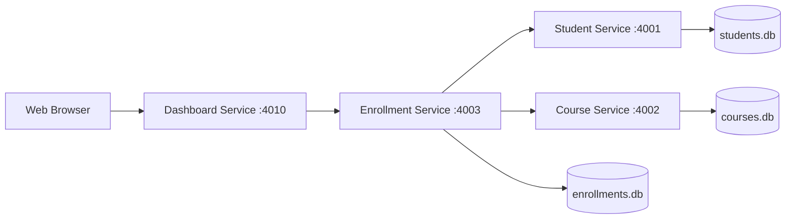

# Deliverable: Architecture Diagrams

## A. Monolithic Architecture

```text
+-------------------+
|   Web Browser     |
+---------+---------+
          |
          | HTTP
          v
+-------------------+
| Monolithic App    |
| (Node + Express)  |
| - Students Module |
| - Courses Module  |
| - Enrollments Mod |
+---------+---------+
          |
          | In-process data access
          v
+-------------------+
| Single Data Store |
| (in-memory)       |
+-------------------+
```

## B. Microservices Architecture

```text
+---------------------+
|   Web Browser UI    |
| (Dashboard Service) |
+----------+----------+
           |
           | HTTP
           v
+---------------------+        +---------------------+
| Enrollment Service  +------->+ Student Service     |
| (Port 4003)         | HTTP   | (Port 4001)         |
+----------+----------+        +----------+----------+
           |                              |
           |                              v
           |                     +---------------------+
           |                     | students.db         |
           |                     +---------------------+
           |
           | HTTP
           v
+---------------------+
| Course Service      |
| (Port 4002)         |
+----------+----------+
           |
           v
+---------------------+
| courses.db          |
+---------------------+

+---------------------+
| enrollments.db      |
| (owned by           |
| Enrollment Service) |
+---------------------+
```

## C. Mermaid Version



## D. Communication Summary

- Enrollment Service validates `studentId` through Student Service using HTTP.
- Enrollment Service validates `courseId` through Course Service using HTTP.
- Each microservice owns and writes to its own database file.
